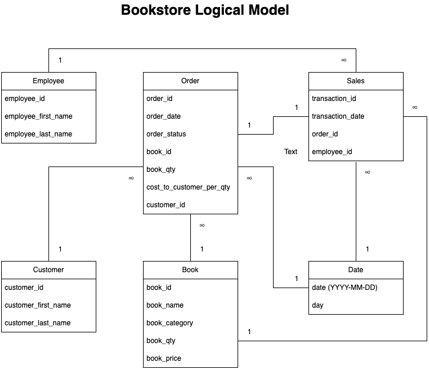
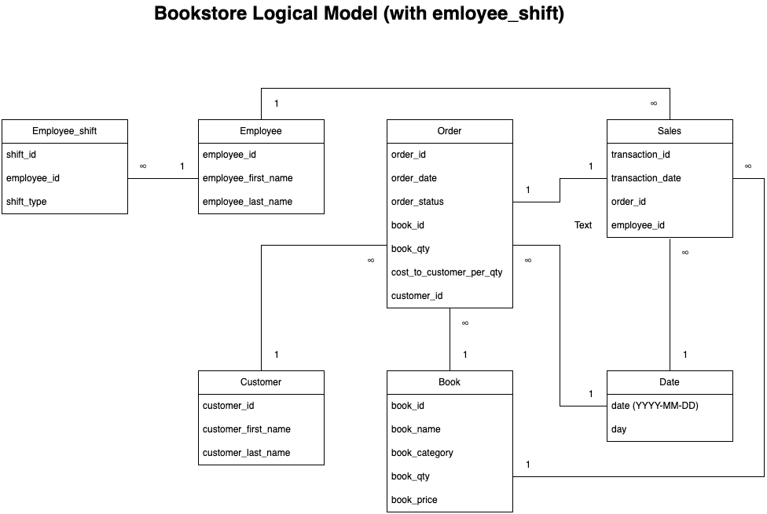

# Assignment 1: Design a Logical Model

## Participant Name: Si Min Zhou

## Question 1

Create a logical model for a small bookstore. 📚

At the minimum it should have employee, order, sales, customer, and book entities (tables). Determine sensible column and table design based on what you know about these concepts. Keep it simple, but work out sensible relationships to keep tables reasonably sized. Include a date table. There are several tools online you can use, I'd recommend [_Draw.io_](https://www.drawio.com/) or [_LucidChart_](https://www.lucidchart.com/pages/).



## Question 2

We want to create employee shifts, splitting up the day into morning and evening. Add this to the ERD.



## Question 3

The store wants to keep customer addresses. Propose two architectures for the CUSTOMER_ADDRESS table, one that will retain changes, and another that will overwrite. Which is type 1, which is type 2?

_Hint, search type 1 vs type 2 slowly changing dimensions._

Bonus: Are there privacy implications to this, why or why not?

```
CUSTOMER_ADDRESS table 1: overwwrite (Type 1 SCD)
-customer_id
-customer_address
-customer_city
-customer_state

CUSTOMER_ADDRESS table 2: retain changes (Type 2 SCD)
-customer_id
-customer_address
-customer_city
-customer_state
-version

Privacy implications: Type 2 SCD might raise privacy concerns because storing a customer's old addresses will potentially result in issues if the data is exposed by accident.

```

## Question 4

Review the AdventureWorks Schema [here](https://imgur.com/a/u0m8fX6)

Highlight at least two differences between it and your ERD. Would you change anything in yours?

```
1. The AdventureWorks Schema is significantly more detailed and granular compared to my ERD. For instance, it breaks down the sales process into multiple specialized tables like SalesTaxRate, ShoppingCartItem, and CreditCard, allowing for more precise tracking of different sales components. In contrast, my ERD takes a more streamlined approach, consolidating sales data into a single table. To improve my ERD, I could introduce more granularity by separating various aspects of the sales process, such as payment methods or tax details, similar to how AdventureWorks handles them.

2. While the AdventureWorks Schema is detailed, it does not explicitly indicate the type of relationships (e.g., one-to-one, one-to-many) between the tables. In my ERD, I’ve taken care to clearly define the relationships between entities, specifying one-to-one, one-to-many, and many-to-many connections. This level of clarity helps ensure a better understanding of how data interacts across the tables.
```

# Criteria

[Assignment Rubric](./assignment_rubric.md)

# Submission Information

🚨 **Please review our [Assignment Submission Guide](https://github.com/UofT-DSI/onboarding/blob/main/onboarding_documents/submissions.md)** 🚨 for detailed instructions on how to format, branch, and submit your work. Following these guidelines is crucial for your submissions to be evaluated correctly.

### Submission Parameters:

- Submission Due Date: `September 28, 2024`
- The branch name for your repo should be: `model-design`
- What to submit for this assignment:
  - This markdown (design_a_logical_model.md) should be populated.
  - Two Entity-Relationship Diagrams (preferably in a pdf, jpeg, png format).
- What the pull request link should look like for this assignment: `https://github.com/<your_github_username>/sql/pull/<pr_id>`
  - Open a private window in your browser. Copy and paste the link to your pull request into the address bar. Make sure you can see your pull request properly. This helps the technical facilitator and learning support staff review your submission easily.

Checklist:

- [ ] Create a branch called `model-design`.
- [ ] Ensure that the repository is public.
- [ ] Review [the PR description guidelines](https://github.com/UofT-DSI/onboarding/blob/main/onboarding_documents/submissions.md#guidelines-for-pull-request-descriptions) and adhere to them.
- [ ] Verify that the link is accessible in a private browser window.

If you encounter any difficulties or have questions, please don't hesitate to reach out to our team via our Slack at `#cohort-4-help`. Our Technical Facilitators and Learning Support staff are here to help you navigate any challenges.
